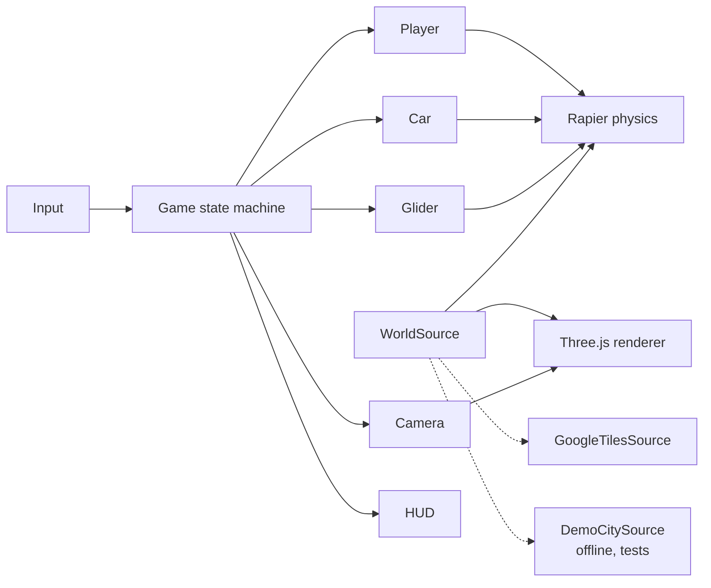

# Manhattan 3D

**A photorealistic, explorable Manhattan in your browser: walk, climb rooftops, drive, and hang-glide
over the real city.**

> 🚧 In development. Current milestone and progress: [`docs/ROADMAP.md`](docs/ROADMAP.md)

<!-- Gameplay video / GIF goes here at M6 -->

## Features (planned for v1)

- Streaming photoreal 3D city from Google Photorealistic 3D Tiles, starting in Lower Manhattan
- Third-person movement: sprint, jump and climb ledges
- Drivable cars with arcade handling and a speed HUD
- A hang glider with banking, lift and landing
- A glass-style HUD with minimap, compass, teleport search and shareable spawn links
- An offline demo city, so the game runs with no API key

## Controls

| Key     | Action                |
| ------- | --------------------- |
| W A S D | Move / steer          |
| Mouse   | Look                  |
| Shift   | Sprint / exit vehicle |
| Space   | Jump / climb          |
| V       | Enter vehicle         |
| H       | Deploy glider         |
| C       | Camera                |
| R       | Reset to spawn        |

## Tech stack

TypeScript · Vite · Three.js · [3DTilesRendererJS](https://github.com/NASA-AMMOS/3DTilesRendererJS) ·
Rapier physics · three-mesh-bvh · Vitest · Playwright

## Architecture



The city provider sits behind a single `WorldSource` interface, so gameplay code never depends on a
specific map vendor. Design rationale: [`docs/DECISIONS.md`](docs/DECISIONS.md).

## Getting started

```bash
npm install
npm run dev
```

The game starts in the offline demo city. To load real Manhattan:

1. Create a Google Cloud project, enable the **Map Tiles API**, and create an API key.
2. **Restrict the key**, which is required:
   - API: Map Tiles API only
   - Website referrers: `http://localhost:*`, `http://127.0.0.1:*`
   - A daily quota cap and a billing budget alert
3. `cp .env.example .env` and paste the key in.

> ⚠️ **Cost and security:** Map Tiles API usage is billed. A browser API key is visible to anyone running
> the app, which is why the restrictions above matter. This project has no hosted demo for that reason.

## Testing

```bash
npm run check      # lint + typecheck + unit tests (never calls paid APIs)
npm run test:e2e   # opt-in browser smoke test (arrives in M2)
```

## How this was built

This project is built with Claude Code as a coding agent, across many sessions:

- [`docs/BUILD_PROMPT.md`](docs/BUILD_PROMPT.md) is the living spec.
- [`CLAUDE.md`](CLAUDE.md) holds the agent's standing rules.
- [`docs/SESSION_LOG.md`](docs/SESSION_LOG.md) records every hand-off.

Each milestone has explicit acceptance criteria, and nothing is marked done until it has been verified.

## Data and attribution

- 3D city imagery and geometry © Google and its data providers. Attribution is shown in-game as required.
- The repository contains **no map data**. Tiles are streamed at runtime and never stored.
- It contains no Apple Maps data or extraction code.
- Asset credits are in `THIRD_PARTY_NOTICES.md` (added with the first assets).

## License

Code: [MIT](LICENSE). Map data and third-party assets remain under their own licenses.
