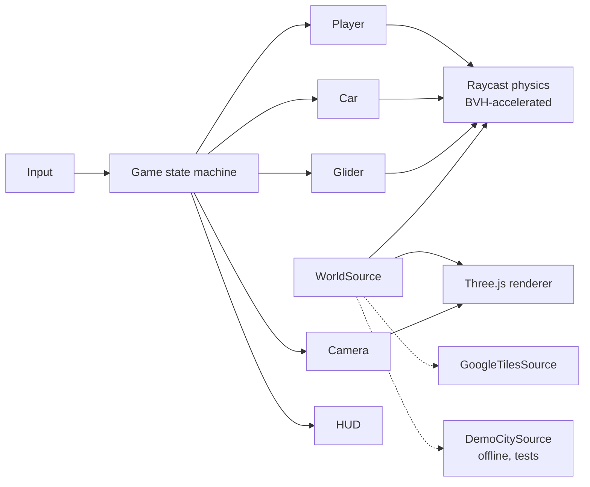

# Manhattan 3D

**A photorealistic, explorable Manhattan in your browser: walk, climb rooftops, drive, and hang-glide
over the real city.**

> 🚧 In development. Current milestone and progress: [`docs/ROADMAP.md`](docs/ROADMAP.md)

<!-- Gameplay video / GIF goes here at M6 -->

## Features

- Streaming photoreal 3D Manhattan from Google Photorealistic 3D Tiles
- Third-person rigged character: walk, sprint, jump, and climb onto ledges
- A drivable NYC taxi with arcade handling (call it to you with V)
- A hang glider with banking, dive and flare, stall, and landing
- A glass-style HUD: photoreal minimap, heading, a teleport bar for 18 landmarks or lat/lon,
  shareable spawn links, avatar colours, a graphics toggle, and a debug overlay
- Streaming-safe physics: no falling through the city while tiles refine
- An offline procedural demo city, so the game runs and is tested with no API key

## Controls

| Key     | Action                                    |
| ------- | ----------------------------------------- |
| Click   | Capture the mouse (Esc releases it)       |
| W A S D | Move · drive · glide (W dives, S flares)  |
| Mouse   | Look                                      |
| Shift   | Sprint                                    |
| Space   | Jump · climb (facing a ledge) · handbrake |
| V       | Enter or exit the taxi, or call it to you |
| H       | Open or close the glider (in the air)     |
| C       | Toggle the wide camera                    |
| Wheel   | Zoom                                      |
| R       | Reset to spawn                            |
| `       | Performance overlay                       |

## Tech stack

TypeScript · Vite · Three.js · [3DTilesRendererJS](https://github.com/NASA-AMMOS/3DTilesRendererJS) ·
three-mesh-bvh · Vitest

## Architecture



The city provider sits behind a single `WorldSource` interface, so gameplay code never depends on a
specific map vendor. Design rationale: [`docs/DECISIONS.md`](docs/DECISIONS.md).

## Getting started

```bash
npm install
npm run dev
```

The game starts in the offline demo city. To load real Manhattan:

1. Create a Google Cloud project, enable the **Map Tiles API**, and create an API key.
2. **Restrict the key**, which is required:
   - API: Map Tiles API only
   - Website referrers: `http://localhost:*`, `http://127.0.0.1:*`
   - A daily quota cap and a billing budget alert
3. `cp .env.example .env` and paste the key in.

> ⚠️ **Cost and security:** Map Tiles API usage is billed. A browser API key is visible to anyone running
> the app, which is why the restrictions above matter. This project has no hosted demo for that reason.

## Testing

```bash
npm run check      # lint + typecheck + unit tests (never calls paid APIs)
```

## How this was built

This project is built with Claude Code as a coding agent, across many sessions:

- [`docs/BUILD_PROMPT.md`](docs/BUILD_PROMPT.md) is the living spec.
- [`CLAUDE.md`](CLAUDE.md) holds the agent's standing rules.
- [`docs/SESSION_LOG.md`](docs/SESSION_LOG.md) records every hand-off.

Each milestone has explicit acceptance criteria, and nothing is marked done until it has been verified.

## Data and attribution

- 3D city imagery and geometry © Google and its data providers. Attribution is shown in-game as required.
- The repository contains **no map data**. Tiles are streamed at runtime and never stored.
- It contains no Apple Maps data or extraction code.
- Character and taxi models by Quaternius. Full credits: [`THIRD_PARTY_NOTICES.md`](THIRD_PARTY_NOTICES.md).

## License

Code: [MIT](LICENSE). Map data and third-party assets remain under their own licenses.
